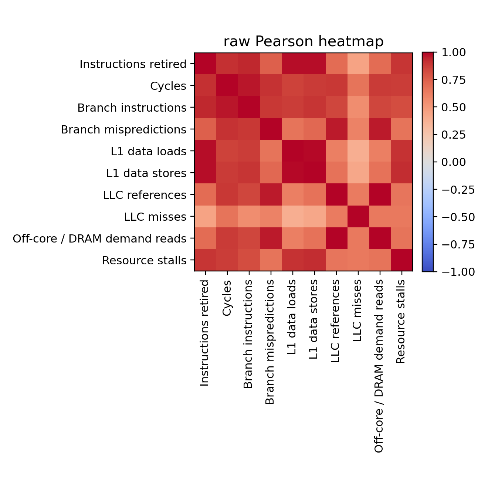
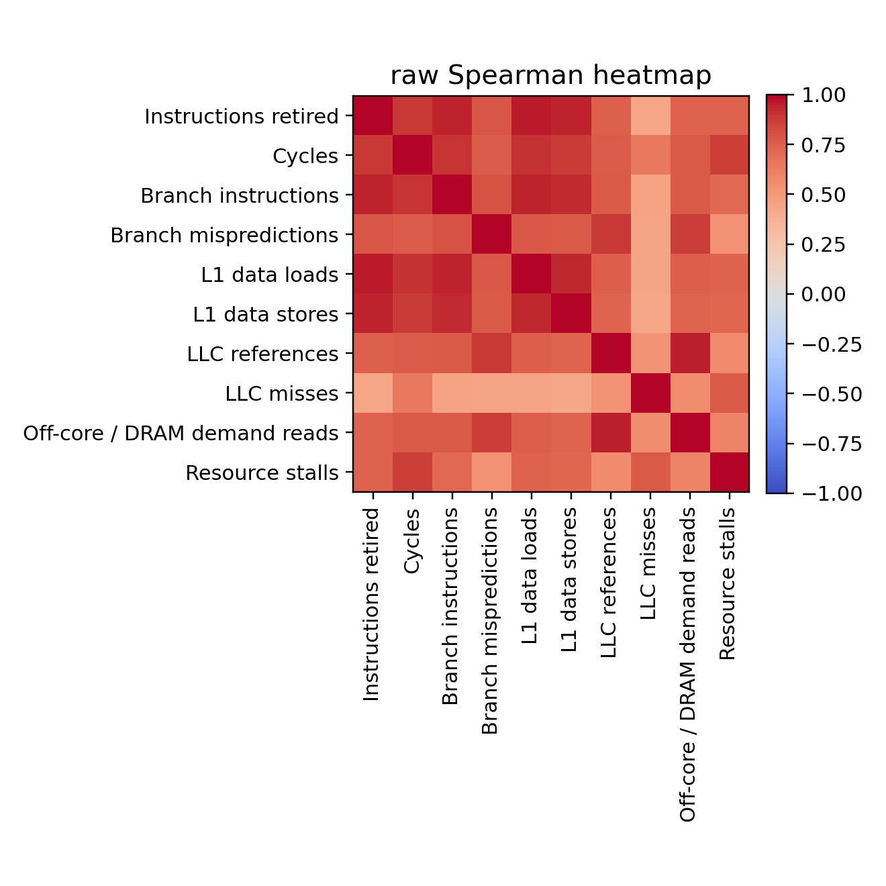
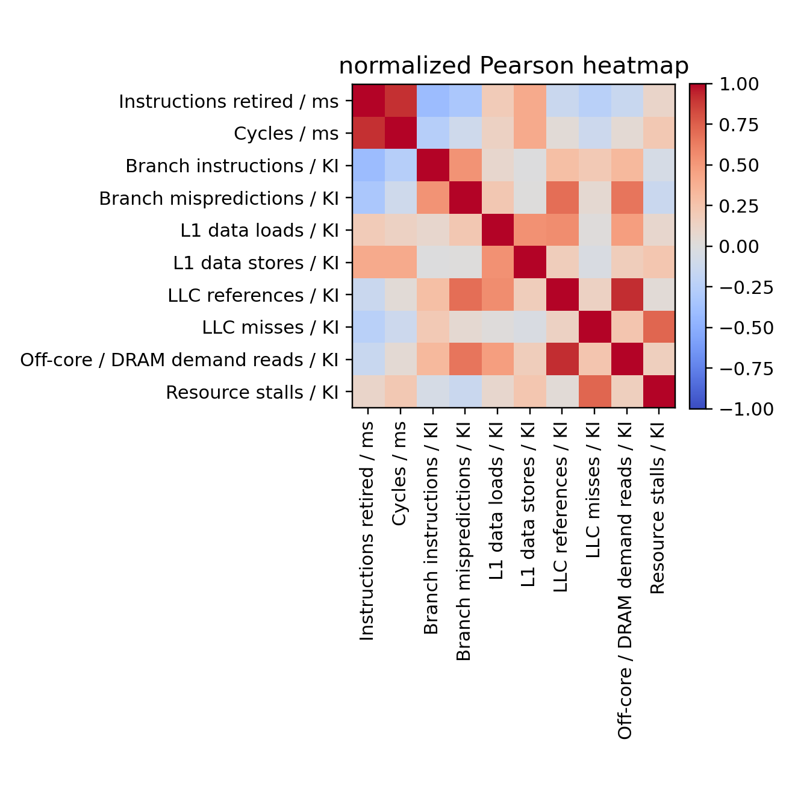
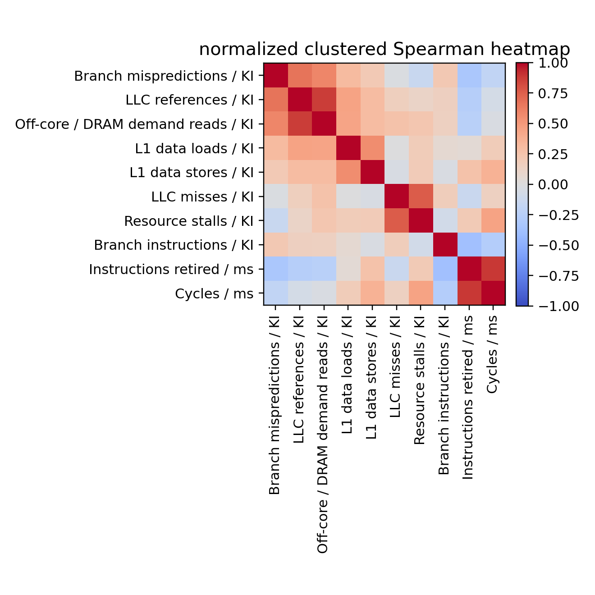
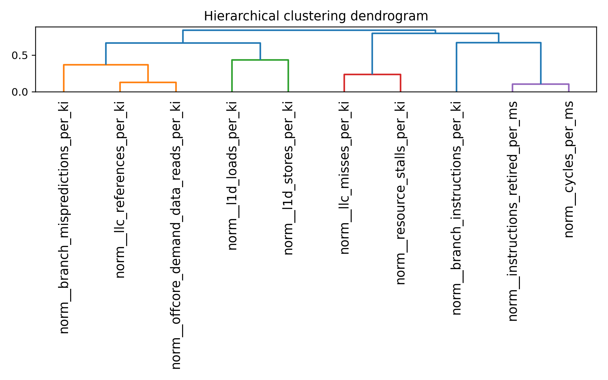
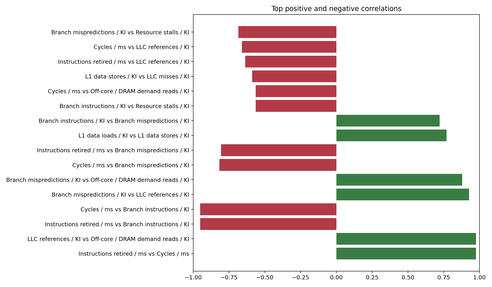
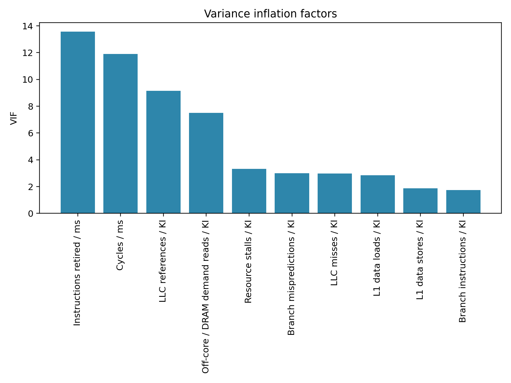

# Multicore Hardware Counter Correlation Study

## Executive Summary

This project collects Linux performance-counter measurements, aligns them with workload metadata and, when available, synthetic phase labels, and studies correlation structure to identify redundant indicators. The main recommendation workflow prefers the normalized Spearman view because raw counters often correlate simply because total activity rose across a sample, not because two indicators capture the same underlying behavior. On this machine, the generated artifact is based on PARSEC workloads collected through `parsecmgmt`.

## Objective

Determine which hardware indicators are highly correlated or redundant so a later phase-classification and phase-prediction pipeline can rely on a smaller, cheaper, and more portable counter set.

## Experimental Setup

- CPU vendor/model: `GenuineIntel` / `Intel(R) Xeon(R) CPU E5-2680 v2 @ 2.80GHz`
- Architecture: `x86_64`
- Logical CPUs: `20`
- Sockets: `2`
- Cores per socket: `10`
- Perf version: `perf version 5.14.0-611.47.1.el9_7.x86_64`
- Intel PCM available: `False`
- CPU family/model id: `6` / `62`
- Strict core PMU study ready: `True`
- Uncore IMC study ready: `False`

## Workload Generation

- Suites in this generated artifact: `parsec`.
- PARSEC available on this host: `True`. SPEC CPU2017 available on this host: `False`.
- Workloads executed: `blackscholes, bodytrack, canneal, fluidanimate, freqmine`.
- Thread counts executed: `1, 2, 4, 8`.
- Repetitions per workload/thread combination: `3`.
- Target collection interval: `10 ms`.
- PARSEC input sizes used: `test`.
- Observed perf-wrapped interval collection wall time: `1594.8 ms median (1193.0 min, 2550.9 max)`.
- Affinity policy: Pinned with `taskset` to the first N online CPUs for the requested thread count.
- `parsec` workload generation: standard PARSEC applications and kernels launched through `parsecmgmt` with taskset-based CPU affinity and the configured PARSEC input set.

## Event Mapping Table

| Family | Selected Event | Supported | Note |
| --- | --- | --- | --- |
| Branch instructions | br_inst_retired.all_branches | Yes | Using preferred host event |
| Branch mispredictions | br_misp_retired.all_branches | Yes | Using preferred host event |
| Cycles | cpu_clk_unhalted.thread | Yes | Using preferred host event |
| Instructions retired | inst_retired.any | Yes | Using preferred host event |
| L1 data loads | mem_uops_retired.all_loads | Yes | Using preferred host event |
| L1 data stores | mem_uops_retired.all_stores | Yes | Using preferred host event |
| LLC misses | longest_lat_cache.miss | Yes | Using preferred host event |
| LLC references | longest_lat_cache.reference | Yes | Using preferred host event |
| Memory read bandwidth | uncore_imc/cas_count_read/ | Yes | Preferred Intel uncore IMC event (system-wide) |
| Memory write bandwidth | uncore_imc/cas_count_write/ | Yes | Preferred Intel uncore IMC event (system-wide) |
| Off-core / DRAM demand reads | offcore_requests.demand_data_rd | Yes | Using preferred host event |
| Resource stalls | resource_stalls.any | Yes | Using preferred host event |
| Total memory bandwidth | derived_total_memory_bandwidth | Yes | Derived from system-wide Intel uncore IMC read+write |

- Confident counters retained for analysis: `Branch instructions, Branch mispredictions, Cycles, Instructions retired, L1 data loads, L1 data stores, LLC misses, LLC references, Off-core / DRAM demand reads, Resource stalls`.
- Confident counters exposed on this host: `Branch instructions, Branch mispredictions, Cycles, Instructions retired, L1 data loads, L1 data stores, LLC misses, LLC references, Memory read bandwidth, Memory write bandwidth, Off-core / DRAM demand reads, Resource stalls, Total memory bandwidth`.
- Generic fallback counters excluded from analysis: `none`.
- Unsupported counter families excluded from analysis: `Floating-point arithmetic, L2 misses`.
- Missing required strict-study families: `none`.
- Uncore readiness note: `System-wide perf is blocked on this host. perf_event_paranoid=2; lower it or grant perf capability for uncore collection.`.

## Dataset Summary

| Statistic | Value |
| --- | --- |
| Interval rows | 9409 |
| Aggregate rows | 0 |
| Runs merged | 60 |
| Manifest runs | 60 |
| Stale raw runs excluded | 213 |
| Observed raw counter columns | 10 |
| Confident counter columns kept | 10 |
| Generic fallback columns excluded | 0 |
| Columns removed as constant | 0 |
| Strict core PMU study ready | Yes |
| Uncore IMC study ready | No |
| Uncore blocked by host policy | Yes |
| Observed system-wide uncore columns | 0 |

## Preprocessing and Derived Metrics

The preprocessing stage handles missing values with median imputation after logging missingness, removes constant columns, creates raw and winsorized views, and derives CPI, IPC, MPKI-style cache/branch/off-core metrics, and FP intensity metrics. Raw-counter and normalized-counter views are intentionally separated because raw counts are strongly scale-sensitive. For normalized and derived analysis views, samples with non-positive interval duration, instructions retired, or cycles are excluded to avoid startup/shutdown artifacts.

- Analysis-ready rows kept: `9306` of `9409`.
- Dropped rows: `103`.
- Drop reasons: `non positive cycles: 100, non positive instructions retired: 100, non positive interval duration ms: 0`.

## Global Correlation Results

Raw counters show which indicators move together at the absolute-count level, but these relationships may largely reflect workload intensity. Normalized counters reduce that effect and are the better basis for redundancy decisions. This Xeon host exposes Intel uncore IMC PMUs, but system-wide collection is currently blocked by host policy, so the present artifact reflects confident core PMU analysis only.

### Raw Pearson Heatmap

### Raw Spearman Heatmap

### Normalized Pearson Heatmap

### Normalized Spearman Heatmap

### Clustered Heatmap

### Dendrogram

## Stratified Results

Stratified analysis is emitted by workload and thread count when enough samples exist. Without explicit phase labels, workload-local stability is the main check on whether redundancy patterns persist across applications.

### Top Positive and Negative Correlations

## Multicollinearity Results

Variance inflation factors complement pairwise correlation: a counter can have moderate pairwise correlations but still be redundant when explained by several others together. VIF is therefore best used alongside correlation-threshold grouping instead of as a replacement.

### VIF Bar Chart

## Feature Selection Recommendations

### G01

- Keep: `Cycles / ms`
- Drop: Instructions retired / ms
- Members: Cycles / ms, Instructions retired / ms
- Reason: Selected for higher portability/interpretability and lower missingness; max within-group |rho|=0.976

### G02

- Keep: `LLC references / KI`
- Drop: Off-core / DRAM demand reads / KI
- Members: LLC references / KI, Off-core / DRAM demand reads / KI
- Reason: Selected for higher portability/interpretability and lower missingness; max within-group |rho|=0.976

The full machine-readable recommendation table remains available in `tables/recommendations.csv`.

## Limitations

- Raw counters can correlate simply because all counts grow with activity, sample duration, or thread count.
- Vendor-specific PMU names differ substantially; unsupported counters are logged and left blank.
- Intel PCM support is best-effort because deployments vary by binary name, permissions, and CLI syntax.
- Per-core task-local attribution is limited without privileged system-wide PMU access.
- Intel uncore IMC bandwidth on this host requires system-wide perf access; when `perf_event_paranoid` blocks that path, the report explicitly omits those system-wide metrics.

## Next Steps

- Validate the recommended reduced set against a downstream phase classifier or predictor.
- Repeat the study on additional Intel, AMD, and Arm systems to compare portability.
- Extend the stratified analysis with application-specific phases from PARSEC or SPEC CPU2017 when those suites are available.
- Lower `perf_event_paranoid` or grant equivalent perf capability on this Xeon host if you want IMC bandwidth collected alongside the strict core PMU set.

## Appendix

- Raw indicators analyzed: `Instructions retired, Cycles, Branch instructions, Branch mispredictions, L1 data loads, L1 data stores, LLC references, LLC misses, Off-core / DRAM demand reads, Resource stalls`
- Derived indicators analyzed: `6`
- Counter families defined in the project: `instructions_retired, cycles, branch_instructions, branch_mispredictions, l1d_loads, l1d_stores, l2_misses, llc_references, llc_misses, offcore_demand_data_reads, fp_arithmetic, resource_stalls, memory_read_bandwidth, memory_write_bandwidth, total_memory_bandwidth`

## How to interpret the results

- Two counters are likely redundant when they remain highly correlated in the normalized Spearman view and also appear in the same high-VIF neighborhood.
- Raw and normalized views can disagree because raw counts mix true behavior with overall workload activity and duration scaling.
- Use correlation to find pairwise or group redundancy, then use VIF to see whether an indicator adds information once the rest of the set is considered.
- Choose a minimal portable counter set by preferring common counters with low missingness and clear meaning, then dropping vendor-specific counters only when a more portable representative preserves the same signal.
